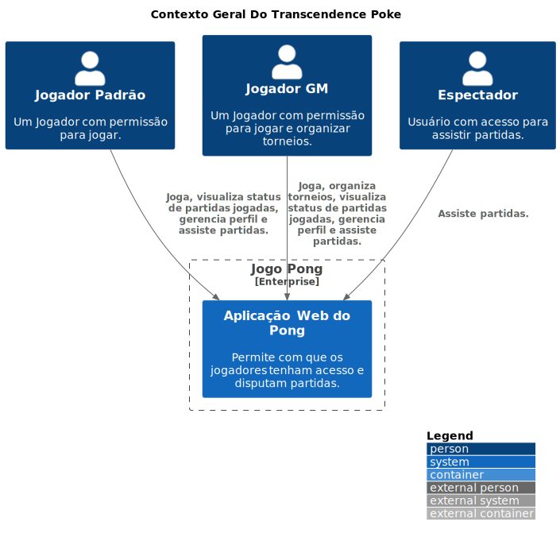

    

# Transcendence Poke
O projeto "Pong Game Multiplayer via Browser" é uma implementação moderna do clássico jogo Pong, adaptado para um ambiente multiplayer na web. Utilizando Python com Django para o backend e JavaScript para o frontend, o jogo permite que os jogadores joguem em tempo real através de seus navegadores em PCs. Além de permitir partidas multiplayer, o jogo também oferece a possibilidade de desafiar uma inteligência artificial (IA) e organizar torneios entre múltiplos jogadores. O sistema é construído com uma arquitetura de microserviços para melhorar a escalabilidade e a manutenção.

## Objetivos
- Criar um jogo Pong multiplayer acessível via navegador web em PCs: Permitir que dois jogadores participem do jogo simultaneamente através de seus navegadores em PCs.
- Implementar uma interface intuitiva e responsiva: Garantir que o jogo seja fácil de jogar e visualmente agradável em diferentes tamanhos de tela de PCs.
- Desenvolver uma solução de comunicação em tempo real: Utilizar WebSockets ou outra tecnologia adequada para garantir uma sincronização eficiente e baixa latência entre o backend e os clientes.
Implementar uma IA desafiadora: Permitir que os jogadores desafiem uma inteligência artificial em partidas individuais.
- Desenvolver um sistema de torneios: Facilitar a organização de torneios entre múltiplos jogadores, possibilitando uma experiência de competição mais estruturada.
Utilizar uma arquitetura de microserviços: Dividir o sistema em serviços menores e independentes para melhorar a escalabilidade e a manutenção, como serviços para gerenciamento de jogos, controle de torneios e interação com a IA.
- Fornecer um código limpo e documentado: Facilitar a compreensão e a manutenção do projeto, além de permitir que outros desenvolvedores contribuam e personalizem o jogo conforme necessário.

## Justificativa
O Pong é um dos primeiros jogos icônicos e uma referência importante na história dos jogos. Atualizá-lo para um formato multiplayer via navegador é uma forma de homenagear este clássico enquanto explora as capacidades modernas da web. A implementação com Python e Django para o backend e JavaScript para o frontend oferece uma solução robusta para comunicação em tempo real e interatividade. A inclusão de uma IA e a possibilidade de torneios tornam o jogo mais envolvente e diversificado, proporcionando uma experiência de jogo rica e desafiadora que pode ser compartilhada e jogada com amigos em PCs. A adoção de uma arquitetura de microserviços permitirá uma maior flexibilidade e eficiência na gestão dos diferentes componentes do sistema.

## Problema
A principal dificuldade neste projeto é garantir uma experiência de jogo fluida e sincronizada para todos os jogadores, considerando que a comunicação entre clientes e o backend deve ser realizada em tempo real. Isso envolve resolver desafios como:

- Latência e sincronização: Garantir que os movimentos dos jogadores, a bola e a IA sejam atualizados em tempo real e que todos os jogadores vejam o mesmo estado do jogo simultaneamente.
- Gerenciamento de conexões: Lidar com possíveis desconexões e reconexões, bem como manter a integridade do jogo durante essas interrupções.
- Desempenho e escalabilidade: Otimizar o código para que o jogo funcione bem em uma ampla gama de PCs e garantir que o servidor suporte múltiplas partidas e torneios simultaneamente sem perda de desempenho.
- Desenvolvimento da IA: Criar uma inteligência artificial que ofereça um desafio adequado e uma experiência de jogo equilibrada para os jogadores.
- Coordenação dos microserviços: Garantir que todos os microserviços trabalhem juntos de forma coesa e que a comunicação entre eles seja eficiente e confiável.

## Contexto Geral

    Diagram as Code

<code>
title Contexto Geral Do Transcendence Poke
Enterprise_Boundary(PongGame, "Jogo Pong") {
    System(PongApp, "Aplicação Web do Pong", "Permite com que os jogadores tenham acesso e disputam partidas.")
}

Person(RegularPlayer, "Jogador Padrão", "Um Jogador com permissão para jogar.")
Person(GMPlayer, "Jogador GM", "Um Jogador com permissão para jogar e organizar torneios.")
Person(Spectator, "Espectador", "Usuário com acesso para assistir partidas.")

Rel(RegularPlayer, PongApp, "Joga, visualiza status de partidas jogadas, gerencia perfil e assiste partidas.")
Rel(GMPlayer, PongApp, "Joga, organiza torneios, visualiza status de partidas jogadas, gerencia perfil e assiste partidas.")
Rel(Spectator, PongApp, "Assiste partidas.")
</code>

## tecnologias

### Microserviço Game Core
- Python & Django
- Postgres
- Docker

### Microserviço Session
- Python & Django
- Postgres
- Docker

### Microserviço Chat
- Python & Django
- Postgres
- Docker

### Microserviço Auth
- Python & Django
- Postgres
- Docker

### Microserviços Statistics
- Python & Django
- Postgres
- Docker

### Microserviço BFF
> Backend for Frontend

- Python & Django
- Postgres
- Docker

### Microserviço Frontend
- Javascript
- Bootstrap
- Docker

### Fila Comunicação Core & Statistics
- RabbitMq

### Fila Comunicação Session & Core
- RabbitMq

### Ferramentas de Gestão de Projeto
- **PlantUML e Mermaid:** Desenvolvimento de diagramas.
- **Github:** Controle de projeto, Armazenamento de Código fonte e CI/CD.
- **Git:** Versionamento de código.

## Requisitos Funcionais

**Autenticação e Autorização:**

1. Os usuários devem ser capazes de se registrar, fazer login e sair do sistema.
2. O sistema deve permitir a recuperação de senha e o gerenciamento de credenciais.
3. O sistema deve garantir que apenas jogadores autorizados possam acessar e gerenciar partidas e torneios.

**Partidas**

4. Os jogadores devem ser capazes de criar novas partidas multiplayer.
5. Os jogadores devem poder se juntar a partidas existentes através de um sistema de convite ou uma lista de partidas disponíveis.
6. O sistema deve permitir que dois jogadores joguem de um mesmo micro, compartilhando o mesmo controle.
7. O sistema deve permitir que jogadores joguem contra um IA.
8. Os jogadores devem poder participar de uma partida contra outro jogador via conexão web.
9. O sistema deve registrar os resultados das partidas.

**Comunicação em Tempo Real:**

6. O sistema deve permitir comunicação em tempo real entre o cliente e o servidor.
7. O sistema deve garantir que todas as atualizações do jogo, como movimentos da bola e das raquetes, sejam sincronizadas em tempo real para todos os jogadores.

**Desafios contra IA:**

7. Permitir que um jogador inicie uma partida contra a IA em vez de um outro jogador.

**Interface de Jogo:**
8. 

**Pontuação e Estatísticas:** 

Manter e exibir a pontuação atual do jogo e as estatísticas do jogador em tempo real.
9. **Gerenciamento de Torneios:** Permitir a criação e a gestão de torneios, incluindo a organização de partidas e o rastreamento dos resultados.
10. **Inscrição em Torneios:** Permitir que os jogadores se inscrevam em torneios e visualizem informações sobre os torneios disponíveis.
11. **Histórico de Jogos:** Fornecer um histórico de jogos jogados, incluindo estatísticas e resultados das partidas.
12. **Gerenciamento de Conexões:** Implementar mecanismos para lidar com desconexões e reconexões dos jogadores durante uma partida.
13. **Controle de Acesso:** 

## Requisitos Não Funcionais

**Acessibilidade:**

1. A interface do usuário é projetada para ser intuitiva e fácil de usar.
2. A interface atende os requisitos necessários para usuários com necessidades espeicias.

**Manutenibilidade:**

3. O código é estruturado de forma modular e bem documentado, facilitando a manutenção e evolução do sistema com práticas de codificação e revisão consistentes.

**Compatibilidade:**

4. O jogo é compatível com diferentes navegadores modernos e sistemas operacionais de PCs.
5. Fornece uma interface gráfica intuitiva e responsiva que funcione bem em diferentes tamanhos de tela de PCs.

**Escalabilidade:**

6. A arquitetura do sistema suporta escalabilidade horizontal, permitindo a adição de novos recursos e instâncias para gerenciar um número crescente de jogadores e partidas simultaneamente.
7. A arquitetura permite a fácil adição de novos recursos e funcionalidades no futuro, mantendo a flexibilidade para incorporar melhorias sem grandes reestruturações.
8. O sistema é portável, permitindo a migração entre diferentes ambientes de hospedagem (cloud, servidores dedicados, etc.) com o mínimo de esforço e sem perda de funcionalidade.
9. O sistema é projetado para facilitar a criação e execução de testes automatizados, garantindo que as funcionalidades e o desempenho possam ser verificados regularmente e de forma eficiente.

**Desempenho:**

9. A latência do sistema é inferior a 100ms entre as ações do jogador e a atualização no servidor, garantindo uma experiência de jogo fluida e responsiva.
