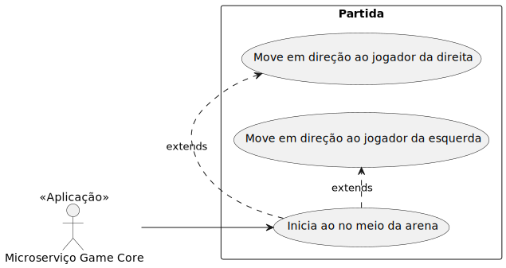
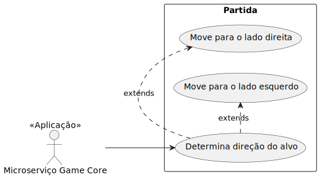
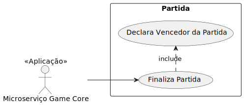
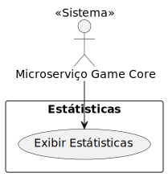
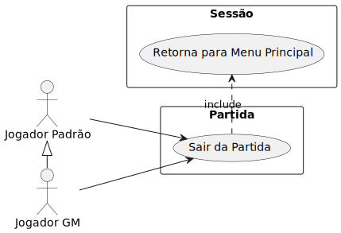
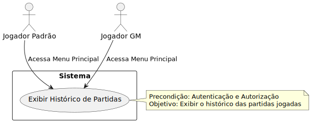

    

# Transcendence Poke
O projeto "Pong Game Multiplayer via Browser" é uma implementação moderna do clássico jogo Pong, adaptado para um ambiente multiplayer na web. Utilizando Python com Django para o backend e JavaScript para o frontend, o jogo permite que os jogadores joguem em tempo real através de seus navegadores em PCs. Além de permitir partidas multiplayer, o jogo também oferece a possibilidade de desafiar uma inteligência artificial (IA) e organizar torneios entre múltiplos jogadores. O sistema é construído com uma arquitetura de microserviços para melhorar a escalabilidade e a manutenção.

## Objetivos
- Criar um jogo Pong multiplayer acessível via navegador web em PCs: Permitir que dois jogadores participem do jogo simultaneamente através de seus navegadores em PCs.
- Implementar uma interface intuitiva e responsiva: Garantir que o jogo seja fácil de jogar e visualmente agradável em diferentes tamanhos de tela de PCs.
- Desenvolver uma solução de comunicação em tempo real: Utilizar WebSockets ou outra tecnologia adequada para garantir uma sincronização eficiente e baixa latência entre o backend e os clientes.
Implementar uma IA desafiadora: Permitir que os jogadores desafiem uma inteligência artificial em partidas individuais.
- Desenvolver um sistema de torneios: Facilitar a organização de torneios entre múltiplos jogadores, possibilitando uma experiência de competição mais estruturada.
Utilizar uma arquitetura de microserviços: Dividir o sistema em serviços menores e independentes para melhorar a escalabilidade e a manutenção, como serviços para gerenciamento de jogos, controle de torneios e interação com a IA.
- Fornecer um código limpo e documentado: Facilitar a compreensão e a manutenção do projeto, além de permitir que outros desenvolvedores contribuam e personalizem o jogo conforme necessário.

## Justificativa
O Pong é um dos primeiros jogos icônicos e uma referência importante na história dos jogos. Atualizá-lo para um formato multiplayer via navegador é uma forma de homenagear este clássico enquanto explora as capacidades modernas da web. A implementação com Python e Django para o backend e JavaScript para o frontend oferece uma solução robusta para comunicação em tempo real e interatividade. A inclusão de uma IA e a possibilidade de torneios tornam o jogo mais envolvente e diversificado, proporcionando uma experiência de jogo rica e desafiadora que pode ser compartilhada e jogada com amigos em PCs. A adoção de uma arquitetura de microserviços permitirá uma maior flexibilidade e eficiência na gestão dos diferentes componentes do sistema.

## Problema
A principal dificuldade neste projeto é garantir uma experiência de jogo fluida e sincronizada para todos os jogadores, considerando que a comunicação entre clientes e o backend deve ser realizada em tempo real. Isso envolve resolver desafios como:

- Latência e sincronização: Garantir que os movimentos dos jogadores, a bola e a IA sejam atualizados em tempo real e que todos os jogadores vejam o mesmo estado do jogo simultaneamente.
- Gerenciamento de conexões: Lidar com possíveis desconexões e reconexões, bem como manter a integridade do jogo durante essas interrupções.
- Desempenho e escalabilidade: Otimizar o código para que o jogo funcione bem em uma ampla gama de PCs e garantir que o servidor suporte múltiplas partidas e torneios simultaneamente sem perda de desempenho.
- Desenvolvimento da IA: Criar uma inteligência artificial que ofereça um desafio adequado e uma experiência de jogo equilibrada para os jogadores.
- Coordenação dos microserviços: Garantir que todos os microserviços trabalhem juntos de forma coesa e que a comunicação entre eles seja eficiente e confiável.

## Contexto Geral

    Diagram as Code

<code>
title Contexto Geral Do Transcendence Poke
Enterprise_Boundary(PongGame, "Jogo Pong") {
    System(PongApp, "Aplicação Web do Pong", "Permite com que os jogadores tenham acesso e disputam partidas.")
}

Person(RegularPlayer, "Jogador Padrão", "Um Jogador com permissão para jogar.")
Person(GMPlayer, "Jogador GM", "Um Jogador com permissão para jogar e organizar torneios.")
Person(Spectator, "Espectador", "Usuário com acesso para assistir partidas.")

Rel(RegularPlayer, PongApp, "Joga, visualiza status de partidas jogadas, gerencia perfil e assiste partidas.")
Rel(GMPlayer, PongApp, "Joga, organiza torneios, visualiza status de partidas jogadas, gerencia perfil e assiste partidas.")
Rel(Spectator, PongApp, "Assiste partidas.")
</code>

## Tecnologias

### Microsserviço Game Core
- Python & Django
- Postgres
- Docker

### Microsserviço Session
- Python & Django
- Postgres
- Docker

### Microsserviço Chat
- Python & Django
- Postgres
- Docker

### Microsserviço Auth
- Python & Django
- Postgres
- Docker

### Microsserviços Statistics
- Python & Django
- Postgres
- Docker

### Microsserviço BFF
> Backend for Frontend

- Python & Django
- Postgres
- Docker

### Microsserviço Frontend
- Javascript
- Bootstrap
- Docker

### Fila Comunicação, Core & Statistics
- RabbitMq

### Fila Comunicação Session & Core
- RabbitMq

### Ferramentas de Gestão de Projeto
- **PlantUML e Mermaid:** Desenvolvimento de diagramas.
- **Github:** Controle de projeto, armazenamento de código e CI/CD.
- **Git:** Versionamento de código.
- **Figma:** Desenho de Interface do usuário.
## Requisitos Funcionais

**Autenticação e Autorização:**

1. **Registro de Usuários:** Os usuários devem ser capazes de se registrar no sistema fornecendo informações básicas, como nome, e-mail e senha.

2. **Login e Logout:** O sistema deve permitir que os usuários façam login com suas credenciais e saiam quando desejarem.

3. **Recuperação de Senha:** O sistema deve oferecer uma funcionalidade para recuperação de senha, permitindo que os usuários redefinam suas senhas caso as esqueçam.

4. **Gerenciamento de Credenciais:** Os usuários devem ter a capacidade de atualizar e gerenciar suas credenciais, incluindo a mudança de senha e a atualização de informações de perfil.

5. **Autorização de Acesso:** O sistema deve garantir que apenas usuários autorizados possam acessar e gerenciar partidas e torneios, implementando controles de acesso baseados em permissões.

6. **Controle de Sessões:** O sistema deve gerenciar sessões de usuário, incluindo a expiração de sessões inativas e a funcionalidade de encerramento de sessões para proteger a segurança do usuário.

7. **Segurança e Proteção de Dados:** O sistema deve implementar medidas de segurança para proteger as informações de credenciais e dados pessoais dos usuários contra acessos não autorizados e ataques cibernéticos.

**Gerenciamento de Partidas:**

8. **Criação de Novas Partidas Multiplayer:** Os jogadores devem ser capazes de criar novas partidas multiplayer com facilidade.

2. **Participação em Partidas Existentes:** Os jogadores devem poder se juntar a partidas já existentes através de um sistema de convites ou por meio de uma lista de partidas disponíveis.

3. **Jogos Locais:** O sistema deve permitir que dois jogadores joguem no mesmo dispositivo, compartilhando um controle.

4. **Jogos contra Inteligência Artificial (IA):** O sistema deve possibilitar que os jogadores joguem contra uma IA.

5. **Conexão Web para Jogos Contra Outros Jogadores:** Os jogadores devem poder participar de partidas contra outros jogadores via conexão web.

6. **Registro de Resultados das Partidas:** O sistema deve registrar e armazenar os resultados das partidas.

7. **Comunicação em Tempo Real:** O sistema deve permitir comunicação em tempo real entre o cliente e o servidor durante as partidas.

8. **Sincronização em Tempo Real:** Todas as atualizações do jogo, como movimentos da bola e das raquetes, devem ser sincronizadas em tempo real para todos os jogadores.

9. **Marcação de Pontuação:** O sistema deve marcar e atualizar a pontuação dos jogadores durante a partida.

10. **Exibição da Pontuação Atual e Estatísticas:** O sistema deve exibir a pontuação atual do jogo e as estatísticas do jogador em tempo real.

11. **Controle do Paddle:** Cada jogador deve ser capaz de controlar seu próprio paddle durante o jogo.

12. **Criação de Torneios por Jogadores GM:** Jogadores com privilégios de GM (Game Master) devem ter a capacidade de criar e gerenciar torneios.

13. **Inclusão e Convite de Jogadores em Torneios:** Jogadores GM devem poder incluir ou convidar outros jogadores para participar de torneios.

14. **Visualização de Partidas por Espectadores:** Espectadores devem ter a capacidade de assistir a partidas ao vivo.

15. **Lista de Partidas Disponíveis para Espectadores:** Espectadores devem poder visualizar uma lista de partidas disponíveis para assistir.

16. **Gerenciamento de Participantes em Torneios:** Jogadores GM devem ser capazes de gerenciar os participantes e as configurações dos torneios.

17. **Relatórios de Desempenho:** O sistema deve gerar relatórios detalhados sobre o desempenho dos jogadores após as partidas e torneios.

18. **Notificações de Eventos:** O sistema deve enviar notificações para jogadores e espectadores sobre eventos importantes, como convites para partidas e atualizações de torneios.

**Estatisticas de Partidas:**

19. **Visualização do Histórico de Partidas:** Os jogadores devem ter a capacidade de visualizar um histórico completo de suas partidas anteriores, incluindo detalhes como data, adversário e resultados.

20. **Consulta de Estatísticas de Partidas:** Os jogadores devem poder acessar e consultar estatísticas detalhadas de cada partida, como número de pontos marcados, erros e outras métricas relevantes.

21. **Comparação de Desempenho:** O sistema deve permitir que os jogadores comparem suas estatísticas de desempenho ao longo do tempo, destacando melhorias ou áreas que necessitam de aprimoramento.

22. **Filtros e Pesquisa de Partidas:** Os jogadores devem poder aplicar filtros e realizar pesquisas no histórico de partidas para encontrar jogos específicos com base em critérios como data, adversário ou tipo de partida.

23. **Geração de Relatórios de Estatísticas:** O sistema deve fornecer a funcionalidade para gerar relatórios detalhados das estatísticas de partidas, que os jogadores podem visualizar na plataforma ou exportar para análise externa.

**Jogabilidade:**

24. **Detecção de Desconexões:** O sistema deve ser capaz de detectar automaticamente quando um jogador se desconecta durante uma partida, identificando a perda de conexão e registrando o evento.

25. **Mecanismos de Reconexão:** O sistema deve fornecer mecanismos para que um jogador desconectado possa reconectar-se à partida em andamento, retomando o jogo a partir do ponto em que foi interrompido, sempre que possível.

26. **Gerenciamento de Estado de Partida:** O sistema deve gerenciar o estado da partida de forma a manter a integridade do jogo durante as desconexões, assegurando que o progresso não seja perdido e que o jogo possa continuar normalmente após a reconexão.

27. **Tratamento de Reconexões Prolongadas:** Se a reconexão demorar mais do que um tempo predeterminado, o sistema deve ter um plano de ação, como permitir que um jogador substituto entre no jogo ou registrar a partida como cancelada, dependendo das regras estabelecidas.

**Menu Principal e Chat:**

28. **Acesso ao Menu Principal:** Os jogadores devem ter a capacidade de acessar o menu principal do sistema a partir de qualquer ponto do jogo, permitindo que retornem facilmente à tela inicial.

29. **Exibição de Opções no Menu Principal:** O menu principal deve exibir opções claras e acessíveis, como iniciar uma nova partida, acessar o histórico de partidas, configurar o perfil, e entrar em outros menus relevantes.

30. **Navegação entre Menus:** O sistema deve permitir a navegação fluida entre diferentes menus, como o menu de partidas, configurações e estatísticas, sem a necessidade de reiniciar o jogo ou perder o progresso.

31. **Modos de Chat:** O sistema deve oferecer diferentes modos de chat, como chat global (para todos os jogadores), chat de equipe (para jogadores em uma mesma equipe) e chat privado (para conversas individuais).

32. **Notificações de Mensagens:** O sistema deve notificar os jogadores sobre novas mensagens recebidas no chat, garantindo que não percam comunicações importantes durante o jogo.

33. **Gerenciamento de Mensagens:** O sistema deve permitir que os jogadores visualizem, respondam e, se necessário, bloqueiem ou silenciem outros jogadores no menu de chat.

34. **Histórico de Chat:** O sistema deve manter um histórico das mensagens trocadas no chat, permitindo que os jogadores revisitem conversas anteriores, se desejado.

35. **Acesso ao Menu de Chat:** O sistema deve incluir um menu de chat acessível a partir do menu principal ou de outros menus, permitindo que os jogadores iniciem ou participem de conversas

## Requisitos Não Funcionais

**Acessibilidade:**

1. A interface do usuário é projetada para ser intuitiva e fácil de usar.
2. A interface atende os requisitos necessários para usuários com necessidades espeicias.

**Manutenibilidade:**

3. O código é estruturado de forma modular e bem documentado, facilitando a manutenção e evolução do sistema com práticas de codificação e revisão consistentes.

**Compatibilidade:**

4. O jogo é compatível com diferentes navegadores modernos e sistemas operacionais de PCs.
5. Fornece uma interface gráfica intuitiva e responsiva que funcione bem em diferentes tamanhos de tela de PCs.

**Escalabilidade:**

6. A arquitetura do sistema suporta escalabilidade horizontal, permitindo a adição de novos recursos e instâncias para gerenciar um número crescente de jogadores e partidas simultaneamente.
7. A arquitetura permite a fácil adição de novos recursos e funcionalidades no futuro, mantendo a flexibilidade para incorporar melhorias sem grandes reestruturações.
8. O sistema é portável, permitindo a migração entre diferentes ambientes de hospedagem (cloud, servidores dedicados, etc.) com o mínimo de esforço e sem perda de funcionalidade.
9. O sistema é projetado para facilitar a criação e execução de testes automatizados, garantindo que as funcionalidades e o desempenho possam ser verificados regularmente e de forma eficiente.

**Desempenho:**

10. A latência do sistema é inferior a 100ms entre as ações do jogador e a atualização no servidor, garantindo uma experiência de jogo fluida e responsiva.

## Casos de uso

**Criar partida contra IA:**

`Ator:` Jogador Padrão ou GM *Autenticado*

`Objetivo:` Criar partida contra IA.

`Descrição:`
- O jogador seleciona a opção para iniciar o jogo contra IA.
- O sistema carrega o jogo e começa uma nova partida.

<code></code>

***

**Criar Multiplayer Local:**

`Ator:` Jogador Padrão ou GM *Autenticado*

`Objetivo:` Criar partida multiplayer local.

`Descrição:`
- O jogador seleciona a opção para iniciar o jogo multiplayer local.
- O sistema carrega o jogo e começa uma nova partida.

<code></code>

***

**Criar Multiplayer Online:**

`Ator:` Jogador Padrão ou GM *Autenticado*

`Objetivo:` Criar partida multiplayer Online.

`Descrição:`
- O jogador seleciona a opção criar partida multiplayer.
- O sistema inclui o jogado em saguão de espera e permite que jogadores entrem na partida.

<code></code>

***

**Convidar Oponente:**

`Ator:` Jogador Padrão ou GM *Autenticado* em sala de partida já criada.

`Objetivo:` Permitir enviar um convite para quando está em uma partida criada.

`Descrição:`
- O jogador seleciona a opção enviar convite.
- O sistema exibe um lista de oponentes.
- O jogador seleciona um oponente.
- O sistema realiza o envio do convite.

<code></code>

***

**Iniciar Partida Multiplayer:**

`Ator:` Jogador Padrão ou GM *Autenticado* em sala de partida já criada.

`Objetivo:` Iniciar partida após jogadores entrarem no saguão.

`Descrição:`
- O sistema verifica se o numéro minimo de jogadores estão presentes e libera botão de inicio.
- O jogador seleciona a opção de inciar partida.
- O sistema carrega o jogo e começa uma nova partida.

<code></code>

***

**Entra em Partida por Convite:**

`Ator:` Jogador Padrão ou GM *Autenticado* fora de partida.

`Objetivo:` Aceitar convite para participar de partida.

`Descrição:`
- O sistema notifica jogador sobre um convite.
- O jogador aceita o convite.
- O sistema verifica quantidade de jogadores na partida.
- O sistema insere o jogador no saguão da partida.

<code></code>

***

**Negar Convite para Partida:**

`Ator:` Jogador Padrão ou GM *Autenticado* fora de partida.

`Objetivo:` Negar convite para partida.

`Descrição:`
- O sistema notifica jogador sobre um convite.
- O jogador nega o convite.
- O sistema notifica jogador dono da partida sobre a recusa.

<code></code>

***

**Negar Convite para Partida Por Tempo:**

`Ator:` Sistema.

`Objetivo:` Sistema revoga convite após x minutos.

`Descrição:`
- O sistema notifica jogador sobre um convite.
- O sistema espera resposta do convidado.
- O sistema cancela convite após x minutos.
- O sistema notifica jogador dono da parida sobre a ausência do jogador convidado.

<code></code>

***

**Notificação de Partida Cheia:**

`Ator:` Sistema.

`Objetivo:` Sistema recusa a entrada de um jogador quando a partida está cheia.

`Descrição:`
- O sistema recebe a solicitação de entrada de um novo jogador.
- O sistema verifica quantidade de jogadores na partida.
- O sistema nega a entrada de um novo jogador.

<code></code>

***

**Movimentação do Paddle:**

`Ator:` Jogador Padrão ou GM *Autenticado* em partida.

`Objetivo:` Mover o paddle (raquete) para cima e para baixo.

`Descrição:`
- O jogador aciona os botões de movimentação (W, S) ou (seta para cima, seta para baixo).
- O Sistema executa a ação na direção indicada.

<code></code>

***

**Pausa de Partida contra IA:**

`Ator:` Jogador Padrão ou GM *Autenticado* em partida contra IA.

`Objetivo:` Pausar a sessão do jogo atual.

`Descrição:`
- O jogador aciona o botão menu no jogo.
- O sistema congela a partida até uma segunda ordem.

<code></code>

***

**Sair de Partida:**

`Ator:` Jogador Padrão ou GM *Autenticado* em partida.

`Objetivo:` Sair da sessão de jogo atual.

`Descrição:`
- O jogador aciona o menu no jogo.
- O jogador aciona o botão de sair.
- O sistema retira o jogador da partida e retorna ao menu principal.

<code></code>

***

**Exibir Pontuação em Partida:**

`Ator:` Sistema.

`Objetivo:` Exibir pontuação da partida.

`Descrição:`
- O sistema exibi a pontuação dos jogadores na parte superior da tela.

<code></code>

***

**Marcar Pontuação para Jogador:**

`Ator:` Jogador

`Precondição:` Jogador Marca um ponto

`Objetivo:` Marca 1 ponto para um jogador.

`Descrição:`
- Target passa pelo limite de alcance de um paddle.
- Sistema contabiliza um ponto para o jogador oposto.
- Sistema inicia um novo round.

Diagram as Code

<code></code>

***

**Inicio do Target:**

`Ator:` Sistema.

`Objetivo:` Posicionamento e direção do target no inicio de cada round.

`Descrição:`
- Sistema posiciona o target no meio do Arena.
- Sistema direciona o target aleátoriamente para um angulo de 45 na direção de um dos jogadores.

Diagram as Code

<code>
@startuml
:Microserviço Game Core: as msGame << Aplicação >>

rectangle Partida {
   (Inicia ao no meio da arena) as (start-position)
   (Move em direção ao jogador da esquerda) as (move-left)
   (Move em direção ao jogador da direita) as (move-right)
    left to right direction
    msGame --> (start-position)
    (start-position) .> (move-right) : extends
    (start-position) .> (move-left) : extends
}
@enduml
</code>

***

**Movimento do Alvo:**

`Ator:` Sistema.

`Precondição:` Jogador acerta o alvo.

`Objetivo:` Regra de direção do alvo.

`Descrição:`
- Alvo colide com o paddle.
- Sistema direciona para um ângulo contrário à projeção do alvo.

Diagram as Code

<code>
@startuml
:Microserviço Game Core: as msGame << Aplicação >>

rectangle Partida {
   (Determina direção do alvo) as (target-direction)
   (Move para o lado esquerdo) as (move-left)
   (Move para o lado direita) as (move-right)
    left to right direction
    msGame --> (target-direction)
    (target-direction) .> (move-right) : extends
    (target-direction) .> (move-left) : extends
}
@enduml
</code>

***

**Finalização de Partida.**

`Ator:` Sistema.

`Precondição:` Jogador atinge pontuação para vencer.

`Objetivo:` Declara a partida como finalizada.

`Descrição:`
- Alvo passa pelo limite de alcance de um paddle.
- Sistema verifica se jogador alcançou a pontuação para vencer.
- Sistema declara partida como encerrada.
- Sistema declara jogador como vencedor.

Diagram as Code

<code>
@startuml
:Microserviço Game Core: as msGame << Aplicação >>

rectangle Partida {
   (Finaliza Partida) as (end-game)
   (Declara Vencedor da Partida) as (winner)
    left to right direction
    msGame --> (end-game)
    (end-game) .> (winner) : include
}
@enduml
</code>

***

**Estatísticas de Final de Partida.**

`Ator:` Sistema.

`Precondição:` Partida encerrada. 

`Objetivo:` Exibe informações da partida.

`Descrição:`
- Sistema encerra partida.
- Sistema exibe informações estatísticas da partida.

Diagram as Code

<code>
@startuml

rectangle Estátisticas {
   (Exibir Estátisticas) as (stat)
}

:Microserviço Game Core: as msGame << Sistema >>
msGame --> (stat)

@enduml
</code>

***

**Sair de Partida Encerrada.**

`Ator:` Jogador ou Jogador GM.

`Precondição:` Autentificação, Autorização, partida encerrada.

`Objetivo:` Sair de partida encerrada e retornar para menu inicial.

`Descrição:`
- Jogador aciona botão de sair da partida.
- Sistema retorna jogador para o menu inicial.

Diagram as Code

<code>
@startuml
:Jogador Padrão: as player
:Jogador GM: as admin

rectangle Partida {
   (Sair da Partida) as (exit)
    left to right direction
    player --> (exit)
    admin --> (exit)
}

rectangle Sessão {
   (Retorna para Menu Principal) as (start)
   (exit) .> (start) : include
}

player <|- admin
@enduml
</code>

***

**Exibir histórico de Partidas.**

`Ator:` Jogador Padrão ou jogador GM.

`Precondição:` Autentificação e Autorização.

`Objetivo:` Exibir o histórico de partidas jogadas.

`Descrição:`
- Jogador acessa Menu principal.
- Sistema exibe o histórico de partidas em uma sessão da interface.

Diagrama as Code

<code>
@startuml
    actor JogadorPadrão as "Jogador Padrão"
    actor JogadorGM as "Jogador GM"
    
    rectangle Sistema {
        usecase "Exibir Histórico de Partidas" as UC1
    }
    
    JogadorPadrão --> UC1 : Acessa Menu Principal
    JogadorGM --> UC1 : Acessa Menu Principal
    
    note right of UC1
      Precondição: Autenticação e Autorização
      Objetivo: Exibir o histórico das partidas jogadas
    end note
@enduml
</code>

***

